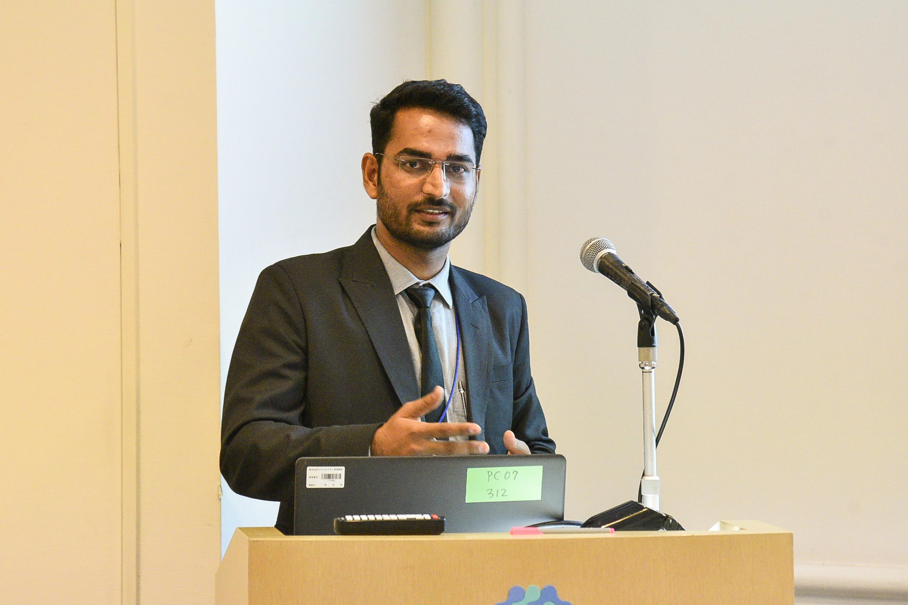

dsfdf
## About me
I'm a PhD student of Aerospace Engineering at Indian Institute of Technology, Kanpur. My field of specialization is Flight Dynamics and Controls.
I completed my bachelors in Electrical and Electronics Engineering from Visvesvaraya National Institute of Technology, Nagpur.
I have a strong interest in studying dynamics and control systems of hybrid VTOL vehicles.

### Here's Me

[comment]: <> (https://shubhanshuv2.github.io/)

 

### Resources
I have made a collection of important blogs/links to read on different topics: [Click Here](https://shubhanshuv2.github.io/Resources.github.io/)
